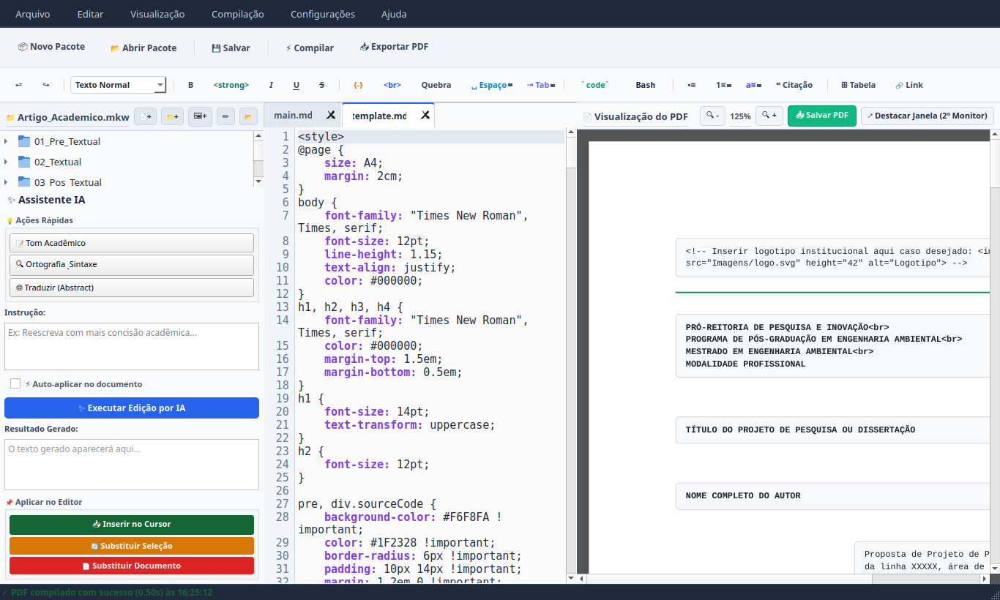

<div align="center">

# 📘 MK Writer
### Editor & Compilador Acadêmico Modular de Markdown para PDF

<p align="center">
  Uma ferramenta integrada para escrita científica, dissertações e relatórios técnicos em Markdown com compilação direta para PDF nas normas ABNT e modelos institucionais.
</p>

<p align="center">
  
  
  
  
  
  
</p>

</div>

---

## 📸 Demonstração da Interface

O **MK Writer** oferece uma experiência integrada em tela dividida: à esquerda, o navegador do projeto e o editor com realce de sintaxe e barra de ferramentas acadêmica; à direita, a pré-visualização contínua do PDF em tempo real, diagramado rigorosamente segundo a norma ABNT.

<p align="center">
  
</p>

---

## 🌟 Visão Geral

O **MK Writer** foi desenvolvido para preencher a lacuna entre a simplicidade do Markdown e o rigor de diagramação exigido por normas acadêmicas como a **ABNT** e programas de pós-graduação.

Em vez de lidar com a curva de aprendizado íngreme e configurações complexas do LaTeX clássico ou as instabilidades de formatação do Microsoft Word/LibreOffice, o pesquisador escreve em Markdown limpo e o **MK Writer** cuida da estruturação, numeração, referências bibliográficas automáticas e compilação do PDF final.

---

## 🎓 Tutorial Rápido: Do Zero ao PDF ABNT

### 1. Criando um Novo Projeto Acadêmico
1. Abra o **MK Writer**.
2. No menu superior, clique em **Arquivo > Novo Pacote de Projeto (.mkw)...** (ou pressione `Ctrl + Shift + P`).
3. Informe o **Título do Trabalho**, seu **Nome/Autor** e selecione onde salvar o arquivo `.mkw`.
4. O aplicativo cria instantaneamente o pacote estruturado com todos os modelos de capa, resumo, abstract, capítulos, referências e estilos ABNT prontos para escrita.

### 2. Organizando o Texto em Capítulos
O painel lateral esquerdo lista todos os arquivos do trabalho de forma hierárquica e modular:
* Abra qualquer seção (por exemplo, `02_Textual/01_introducao.md`) com um duplo clique.
* Redija seu texto normalmente usando cabeçalhos Markdown (`#` para títulos de seções primárias, `##` para secundárias).
* O arquivo mestre `main.md` une automaticamente todas as partes do documento utilizando a diretiva:
  ```markdown
  !include 02_Textual/01_introducao.md
  ```

### 3. Utilizando a Barra de Ferramentas Acadêmica
A barra superior conta com botões dedicados para inserir elementos padronizados nas normas ABNT:
* **📐 Equações Matemáticas (`fx`)**: Insere fórmulas com sintaxe LaTeX ($$ f(x) = \int_{0}^{\infty} e^{-x} dx $$).
* **🖼️ Figuras com Fonte (`Figura`)**: Insere o bloco com identificador superior e a fonte obrigatória na parte inferior.
* **📊 Tabelas (`Tabela`)**: Adiciona uma grade pré-formatada pronta para dados estatísticos ou experimentais.
* **📚 Citações BibTeX**:
  * Adicione suas referências no arquivo `referencias.bib` do projeto.
  * No texto, cite diretamente usando `@chave` para citações no corpo (ex: *Segundo @silva2024...*) ou `[@chave, p. 15]` para citações entre parênteses.
* **📄 Quebra de Página**: Insere a tag `<div class="page-break"></div>` para forçar o início de um novo capítulo em página limpa.

### 4. Compilando e Pré-Visualizando em Tempo Real
* Pressione **`F5`** (ou clique no botão **Compilar**).
* Em segundos, o motor de compilação gera o documento completo com margens ABNT (3 cm superior/esquerda, 2 cm inferior/direita), numeração de páginas padronizada e sumário dinâmico no visualizador direito.
* Para exportar o arquivo PDF final pronto para envio, submissão ou impressão, selecione **Arquivo > Exportar PDF...** (ou pressione `Ctrl + E`).

---

## 📦 Estrutura de Pastas e Arquivos do Pacote (`.mkw`)

O formato **`.mkw`** (*MK Writer Package*) é um container autocontido e portátil que reúne todos os componentes do trabalho científico em um único arquivo, garantindo que imagens, estilos e referências nunca se percam ao compartilhar ou mover o projeto.

### 🗂️ Diagrama da Estrutura Interna

```text
📁 Meu_Trabalho_Academico.mkw (Arquivo único do projeto)
│
├── 📄 project.json           # Metadados do projeto (título, autor, versão e ponto de entrada)
├── 📄 main.md                # Arquivo orquestrador mestre (reúne os capítulos via !include)
├── 🎨 style.md               # Folha de diagramação CSS/ABNT (margens, fontes, recuo de parágrafo)
├── 📚 referencias.bib        # Base bibliográfica BibTeX para citações e referências automáticas
│
├── 📁 01_Pre_Textual/        # Elementos pré-textuais obrigatórios e opcionais
│   ├── 01_capa.md            # Capa formatada institucional com dados do trabalho
│   ├── 02_resumo.md          # Resumo em português em parágrafo único e palavras-chave
│   ├── 03_abstract.md        # Resumo em língua estrangeira (Abstract e Keywords)
│   └── 04_sumario.md         # Sumário dinâmico com pontilhado e paginação automática
│
├── 📁 02_Textual/            # Corpo do trabalho acadêmico (desenvolvimento científico)
│   ├── 01_introducao.md      # Introdução, justificativa e objetivos da pesquisa
│   ├── 02_desenvolvimento.md # Revisão de literatura, metodologia e discussão dos resultados
│   └── 03_conclusao.md       # Considerações finais, conclusões e trabalhos futuros
│
├── 📁 03_Pos_Textual/        # Elementos pós-textuais
│   └── 02_referencias.md     # Seção onde a lista de referências ABNT é renderizada
│
└── 📁 imagens/               # Repositório de ilustrações, gráficos, diagramas e fotos
```

### 📋 Detalhamento dos Componentes

| Arquivo / Pasta | Finalidade e Descrição |
| :--- | :--- |
| **`project.json`** | Registra as configurações do documento: título, autor, versão do schema e o arquivo de compilação principal (`main.md`). |
| **`main.md`** | O arquivo master do trabalho. Ele utiliza a diretiva `!include caminho/arquivo.md` para unificar todos os capítulos e seções na ordem correta. |
| **`style.md`** | Folha de regras tipográficas e de diagramação (CSS print) pré-configurada para papel A4, margens ABNT (3-3-2-2 cm), espaçamento entre linhas de 1,5, recuo de primeira linha (1,25 cm) e fontes acadêmicas (Times New Roman / Arial). |
| **`referencias.bib`** | Arquivo no formato universal BibTeX onde você armazena seus artigos, livros e teses. Compatível com Mendeley, Zotero e Google Acadêmico. |
| **`01_Pre_Textual/`** | Abriga elementos que antecedem o texto principal: Capa institucional, Resumo com contagem de palavras, Abstract e o Sumário gerado por filtro automatizado. |
| **`02_Textual/`** | Os capítulos centrais da pesquisa divididos em arquivos independentes para facilitar a escrita e a revisão. |
| **`03_Pos_Textual/`** | Elementos após o texto, como a geração da lista de referências segundo a `abnt.csl` e eventuais apêndices/anexos. |
| **`imagens/`** | Pasta local onde ficam armazenadas as figuras referenciadas no Markdown (``). |

---

## 🚀 Principais Funcionalidades

### 1. ✍️ Editor Markdown Modular & Focado
* **Estrutura Acadêmica**: Organização automática em seções **Pré-Textuais**, **Textuais** e **Pós-Textuais**.
* **Pacotes de Projeto (`.mkw`)**: Formato exclusivo que encapsula capítulos, imagens, estilos e base bibliográfica em um único arquivo portátil.

### 2. 📄 Compilação Acadêmica ABNT
* **Citações e Referências Automáticas**: Integração nativa com arquivos BibTeX (`.bib`) e regras da ABNT (`abnt.csl`).
* **Sumário Inteligente**: Geração automática de sumário dinâmico e paginação conforme as normas institucionais.
* **Centralização de Elementos**: Ajuste automático de figuras, tabelas, equações matemáticas e fontes.

### 3. 👁️ Pré-Visualizador PDF em Tempo Real
* Renderização direta na tela lado a lado com o editor através do motor **PyQtWebEngine**.
* Suporte a navegação rápida por páginas, ajuste de zoom e recarregamento automático após compilação.

### 4. 🧰 Barra de Ferramentas Acadêmica
* Atalhos de inserção com um clique para:
  * Equações matemáticas em formato LaTeX/MathJax.
  * Inserção e importação de figuras com legenda e fonte obrigatória da ABNT.
  * Tabelas formatadas e notas de rodapé.
  * Citações diretas e indiretas.

### 5. 🤖 Assistente de IA Integrado
* Módulo de apoio à escrita acadêmica para revisão gramatical, aprimoramento de estilo científico e sugestões de transição textual.

---

## 🛠️ Instalação e Execução

### Opção 1: Executável Portátil para Windows (.exe)

O **MK Writer** pode ser executado diretamente no **Windows 10 ou 11** sem necessidade de instalar Python:

1. Acesse a aba [Releases](https://github.com/dbarcelospro/MK-Writer/releases) (ou [Actions](https://github.com/dbarcelospro/MK-Writer/actions)) e baixe o arquivo:
   ```text
   MK-Writer-Windows.zip
   ```
2. Clique com o botão direito no arquivo baixado e escolha **"Extrair Tudo..."**.
3. Abra a pasta extraída e dê um duplo clique em **`MK-Writer.exe`**.

---

### Opção 2: Instalação Automática no Linux (Recomendado)

O repositório inclui um instalador completo com suporte a temas de ícones e registro no menu do sistema:

```bash
git clone https://github.com/dbarcelospro/MK-Writer.git
cd MK-Writer
./instalar_atalho.sh
```

Isso registrará o **MK Writer** no seu menu de aplicativos (Dash/GNOME/KDE) e associará automaticamente os arquivos de extensão **`.mkw`** ao programa.

---

### Opção 3: Execução pelo Código-Fonte (Python no Linux ou Windows)

#### 1. Pré-requisitos de Sistema
Para compilação de PDFs via Pandoc e WeasyPrint:
```bash
sudo apt update
sudo apt install -y pandoc weasyprint
```

#### 2. Configurar o Ambiente Virtual
```bash
git clone https://github.com/dbarcelospro/MK-Writer.git
cd MK-Writer
python3 -m venv venv
source venv/bin/activate
pip install -r requirements.txt
```

#### 3. Iniciar o Aplicativo
```bash
python main.py
```

---

## 📁 Estrutura do Repositório

```text
MK-Writer/
├── main.py                     # Ponto de entrada e inicialização da aplicação
├── app/                        # Módulos centrais do editor e visualizador
│   ├── main_window.py          # Janela principal e coordenação da interface
│   ├── editor.py               # Editor com realce de sintaxe e numeração
│   ├── compiler.py             # Motor de compilação Pandoc/WeasyPrint/ABNT
│   ├── pdf_viewer.py           # Visualizador de PDF integrado via WebEngine
│   ├── formatting_toolbar.py   # Barra de ferramentas e atalhos rápidos
│   ├── file_tree.py            # Árvore de navegação e arquivos de projeto
│   ├── package_manager.py      # Gerenciamento de pacotes .mkw
│   └── ai_assistant.py         # Módulo do assistente de inteligência artificial
├── resources/                  # Estilos, ícones, regras ABNT e modelos
│   ├── abnt.csl                # Estilo oficial de citação ABNT
│   ├── style.md                # Folha de estilo de diagramação CSS/Markdown
│   ├── template.md             # Modelo estrutural de artigo/monografia
│   └── toc.lua                 # Filtro Lua para geração de sumário ABNT
├── docs/                       # Documentação e capturas de tela do sistema
│   └── images/                 # Imagens da interface para documentação
├── Imagens/                    # Ativos gráficos da interface (ícones SVG)
├── tests/                      # Bateria de testes automatizados do sistema
├── requirements.txt            # Dependências em Python
├── MANUAL_DE_INSTALACAO.md     # Guia completo offline de uso e configuração
├── CONTRIBUTING.md             # Guia para novos colaboradores
└── LICENSE                     # Licença de código aberto MIT
```

---

## 🤝 Como Contribuir

Contribuições para o **MK Writer** são muito bem-vindas! Consulte o arquivo [CONTRIBUTING.md](CONTRIBUTING.md) para diretrizes sobre como relatar problemas, propor melhorias em regras de formatação e enviar *Pull Requests*.

---

## 👤 Autor

* **Danilo Barcelos** — *Idealizador e Desenvolvedor Principal*  
  Concepção do ambiente de escrita modular, modelagem das regras ABNT e desenvolvimento da arquitetura do software.

---

## 📄 Licença

Este projeto está licenciado sob a **MIT License** — consulte o arquivo [LICENSE](LICENSE) para mais detalhes. Livre para utilização pessoal, acadêmica e profissional.
